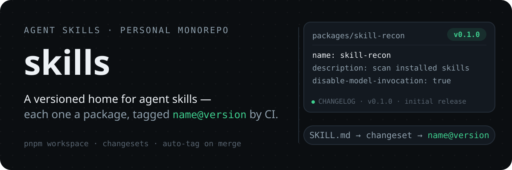
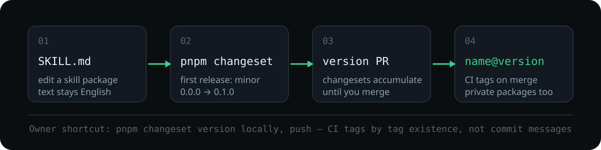

# skills

<p align="center">
  
</p>

A personal monorepo for agent skills. Every skill ships as a private package under `packages/<name>/` — a `SKILL.md` plus a `package.json` — versioned with [changesets](https://github.com/changesets/changesets). Pushing to `main` runs the Release workflow: pending changesets accumulate into one version PR, and merging it tags every bumped package `name@version`.

## Skills

| Skill | Version | What it does |
| --- | --- | --- |
| [skill-recon](packages/skill-recon/SKILL.md) | `0.1.0` | Scan any installed skill: inventory its files, annotate each file's purpose, reconstruct its design logic, and surface controllability red flags. |
| [skill-release](.agents/skills/skill-release/SKILL.md) | — | The release playbook for this repo: scaffold a skill package, version it with changesets, and ship it via version PR or direct push. |

## How a skill ships

<p align="center">
  
</p>

1. **Scaffold** `packages/<name>/` — a `package.json` and a `SKILL.md`, written in English (repo rule).
2. **Add a changeset** — `pnpm changeset`; a first release is `minor` (`0.0.0` → `0.1.0`).
3. **Push to `main`** — CI opens the cumulative version PR, *"chore: version skills"*.
4. **Squash-merge it** — CI tags every bumped package `name@version`; private packages are tagged too.

> **Owner shortcut:** `main` is protected (linear history + signed commits), but as the owner you can bypass the ruleset. Run `pnpm changeset version` locally, commit, and push — CI tags any package whose `name@version` tag is missing, and never inspects commit messages.

## Ship your first skill

Requires Node.js 22 and pnpm 10.

```bash
pnpm install
pnpm changeset            # first release: minor
git add .changeset && git commit -m "chore: add changeset"
git push                  # CI opens the "chore: version skills" PR
```

Squash-merge the version PR — CI tags versions like `skill-recon@0.1.0` automatically. Or skip the PR entirely:

```bash
pnpm changeset version    # bump versions, update CHANGELOGs, consume changesets
git add -A && git commit -m "chore: version skills"
git push
```

**Fallbacks**

- CI did not open the version PR: the workflow still pushes `changeset-release/main` — create it manually with `gh pr create --base main --head changeset-release/main --title "chore: version skills"`.
- CI did not tag after merge: confirm `.changeset/config.json` keeps `privatePackages.tag: true`; `pnpm changeset tag` tags locally only, never pushes.

## Repo layout

```text
packages/<name>/     skill packages — SKILL.md, package.json, CHANGELOG.md
.agents/skills/      installed skills and local workflow skills
.changeset/          pending changesets
.github/workflows/   Release workflow
```

## Notes

- Skill text must be written in English.
- Version PRs are cumulative — changesets from several skills pile into one PR until you merge it.
- Tags use the `name@version` form (e.g. `skill-recon@0.1.0`), and private packages are tagged.
